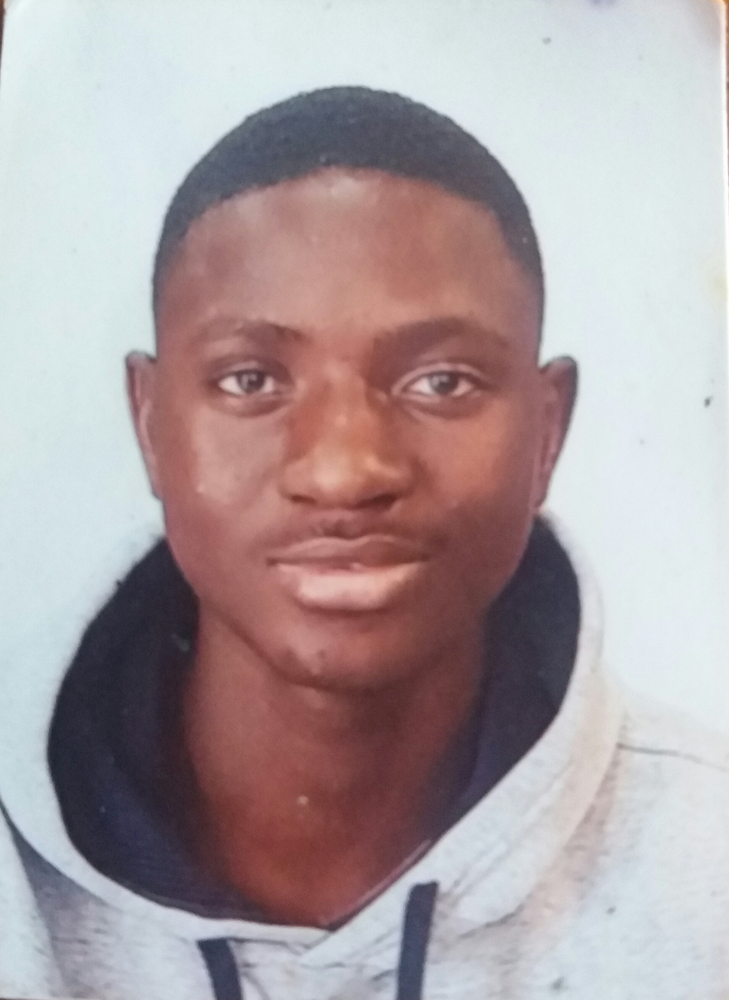

# Curriculum Vitea
### Moussa Keita
  
### Histarial academico  
#### Manolo hugué  
14 de septiembre del 2019 – 22 de junio del 2020  
Estudie la eso en manolo hugué, Caldes de montbui  
#### Innovación en formación profesional (ifp)  
Ahora mismo estoy haciendo un curso de informática   
de grado medio durar dos años,  y estoy haciendo el segundo.  
### Experiencia 
#### tienda de comida de animales
En mi anterior trabajo yo me encargaba de ayudar  a los clientes
### dirección
Bellpuig 25 ES.IZQ 3,2
Código postal
08203
### Contacto
TELÉFONO:
657317286  
CORREO ELECTRÓNICO:
Keitamoussap2003@gmail.com
### Aficiones
salir con los amigos  
jugar a los videojuegos  
Jugar a fútbol  
### Idioma
Castellano  
Catalan  
Mandinga  
### Mis proyectos
<a href="">Visit W3Schools</a>

